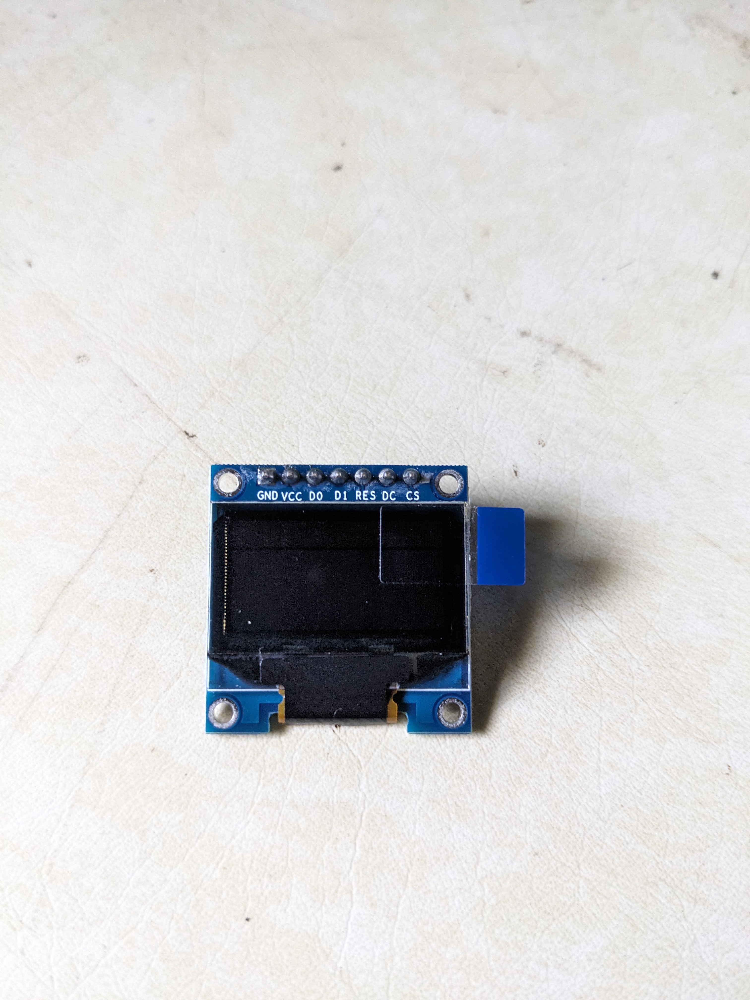

# ESP32 OLED Display Configuration

This project demonstrates how to interface a 0.96" OLED display (SSD1306) with ESP32 using SPI.

## Features
- SPI interface implementation
- Simple text display functions
- PlatformIO compatible

## Hardware Connections
| OLED Pin | ESP32 Pin |
|----------|-----------|
| GND      | GND       |
| VCC      | 3.3V      |
| D0       | GPIO 18   |
| D1       | GPIO 23   |
| RES      | GPIO 4    |
| DC       | GPIO 2    |
| CS       | GPIO 5    |

## Usage
1. Clone this repository
2. Open in PlatformIO or Arduino IDE
3. Build and upload to ESP32
